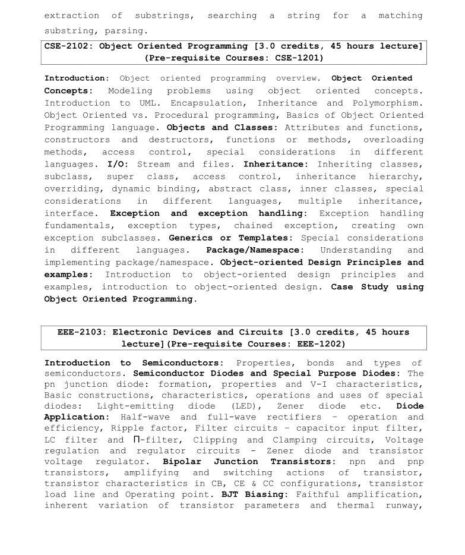

## CSE-2102: Object Oriented Programming

Course Teacher

- MD. TOHIDUL ISLAM, ASSOCIATE PROFESSOR, Dept of CSE, University of Rajshahi

Reference Books

- Java™ The Complete Reference, Herbert Schildt, Ninth Edition

##

### Introduction:

    Object oriented programming overview.

[Introduction](./slides/Lecture_1.pdf)

### Object Oriented Concepts:

    Modeling problems using object oriented concepts.
    Introduction to UML. Encapsulation, Inheritance and Polymorphism.
    Object Oriented vs. Procedural programming, Basics of Object Oriented
    Programming language.

[OOP Analysis](./slides/Lecture_2.pdf)

### Objects and Classes:

    Attributes and functions,
    constructors and destructors, functions or methods, overloading
    methods, access control, special considerations in different
    languages.

[OOP Concept](./slides/Lecture_6-Basic%20Conecpts%20and%20Features%20of%20OOP.pdf)

### I/O:

    Stream and files.

### Inheritance:

    Inheriting classes,
    subclass, super class, access control, inheritance hierarchy,
    overriding, dynamic binding, abstract class, inner classes, special
    considerations in different languages, multiple
    inheritance, interface.

### Exception and exception handling:

    Exception handling
    fundamentals, exception types, chained exception, creating own
    exception subclasses.

### Generics or Templates:

    Special considerations in different languages.

### Package/Namespace:

    Understanding and
    implementing package/namespace.

### Object-oriented Design Principles and examples:

    Introduction to object-oriented design principles and
    examples, introduction to object-oriented design.

### Case Study using Object Oriented Programming.

#### Course Outline

