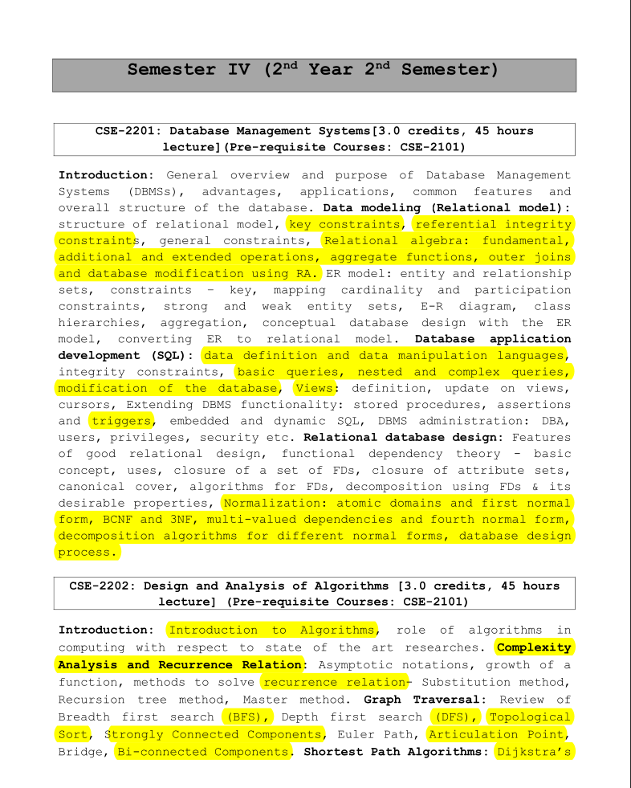

## CSE-2201: Database Management Systems

Course Teacher

- Md. Anwarul Islam, Lecturer, Dept. of CSE,
  Sheikh Hasina University

Reference Books

- Database System Concepts by Abraham Silberschatz, Henry F. Korth, and S. Sudarshan (7th Edition)

##

### Introduction:

    General overview and purpose of Database Management
    Systems (DBMSs), advantages, applications, common features and
    overall structure of the database.

[Introduction](./slides/ch1.pdf)

### Data modeling (Relational model):

    structure of relational model, key constraints, referential integrity
    constraints, general constraints, Relational algebra: fundamental,
    additional and extended operations, aggregate functions, outer joins
    and database modification using RA. ER model: entity and relationship
    sets, constraints – key, mapping cardinality and participation
    constraints, strong and weak entity sets, E-R diagram, class
    hierarchies, aggregation, conceptual database design with the ER
    model, converting ER to relational model.

[Intro to relational model](./slides/ch2.pdf) 
[Database Design Using the E-R Model](./slides/ch6.pdf)

### Database application development (SQL):

    data definition and data manipulation languages,
    integrity constraints, basic queries, nested and complex queries,
    modification of the database, Views: definition, update on views,
    cursors, Extending DBMS functionality: stored procedures, assertions
    and triggers, embedded and dynamic SQL, DBMS administration: DBA,
    users, privileges, security etc.

[Intro to sql](./slides/ch3.pdf) 
[Intermediate sql](./slides/ch4.pdf)

### Relational database design:

    Features of good relational design, functional dependency theory - basic
    concept, uses, closure of a set of FDs, closure of attribute sets,
    canonical cover, algorithms for FDs, decomposition using FDs & its
    desirable properties, Normalization: atomic domains and first normal
    form, BCNF and 3NF, multi-valued dependencies and fourth normal form,
    decomposition algorithms for different normal forms, database design
    process.

[Normalization](./slides/ch7.pdf)

extra:

[Complex Data Types](./slides/ch8.pdf) 
[Physical Storage Systems](./slides/ch12.pdf) 
[Indexing](./slides/ch14.pdf)

#### Course Outline

