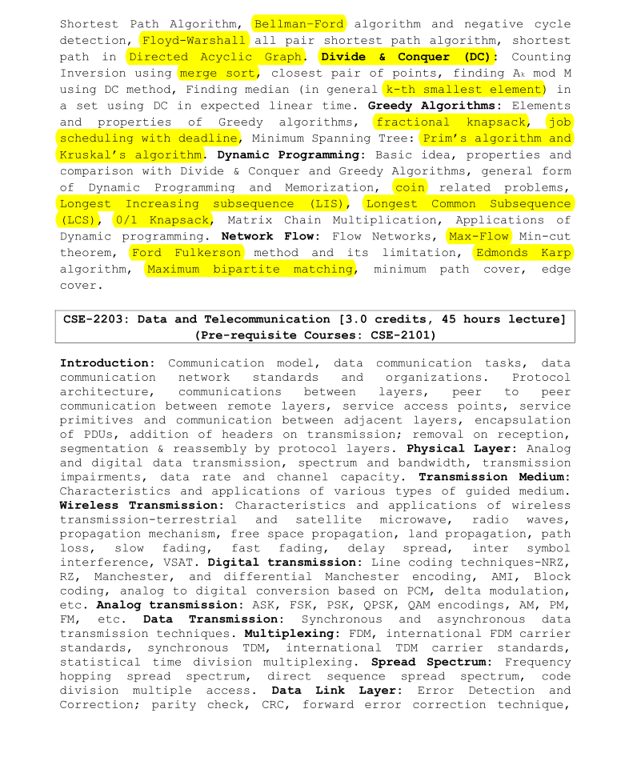

## CSE-2203: Data and Telecommunication

Course Teacher

- Shifat Ara Rifat, Lecturer, Dept. of CSE,
  Sheikh Hasina University

Reference Books

- Data and Computer Communications by Willian Stallings (10th Edition)
- Data Communications and Networking, Fourth Edition by Behrouz A. Forouzan

##

### Introduction:

    Communication model, data communication tasks, data communication network standards and organizations.
    Protocol architecture, communications between layers, peer to peer communication between remote layers,
    service access points, service primitives and communication between adjacent layers, encapsulation of
    PDUs, addition of headers on transmission; removal on reception, segmentation & reassembly by protocol
    layers.

[Introduction](./slides/ch1_v1.ppt) 
[Network Models](./slides/ch2_v1.ppt) 
[Network Models Part 2](./slides/ch2_v2.ppt) 
[TCP IP Protocol Suite](./slides/LEC_5-6.pptx)

### Physical Layer:

    Analog and digital data transmission, spectrum and bandwidth, transmission
    impairments, data rate and channel capacity.

[Data and Signal](./slides/ch3_Data-and-Signals.ppt)

### Transmission Medium:

    Characteristics and applications of various types of guided medium.

### Wireless Transmission:

    Characteristics and applications of wireless
    transmission-terrestrial and satellite microwave, radio waves,
    propagation mechanism, free space propagation, land propagation, path
    loss, slow fading, fast fading, delay spread, inter symbol
    interference, VSAT.

### Digital transmission:

    Line coding techniques-NRZ,
    RZ, Manchester, and differential Manchester encoding, AMI, Block
    coding, analog to digital conversion based on PCM, delta modulation,
    etc.

### Analog transmission:

    ASK, FSK, PSK, QPSK, QAM encodings, AM, PM,
    FM, etc.

### Data Transmission:

    Synchronous and asynchronous data
    transmission techniques.

### Multiplexing:

    FDM, international FDM carrier
    standards, synchronous TDM, international TDM carrier standards,
    statistical time division multiplexing.

### Spread Spectrum:

    Frequency hopping spread spectrum, direct sequence spread spectrum, code
    division multiple access.

### Data Link Layer:

    Error Detection and
    Correction; parity check, CRC, forward error correction technique,linear
    block code, hamming code, etc.

### Data Link Control:

    Line configurations, flow control and error control techniques- sliding
    window, stop and wait ARQ, selective reject ARQ and HDLC protocols.

#### Course Outline

