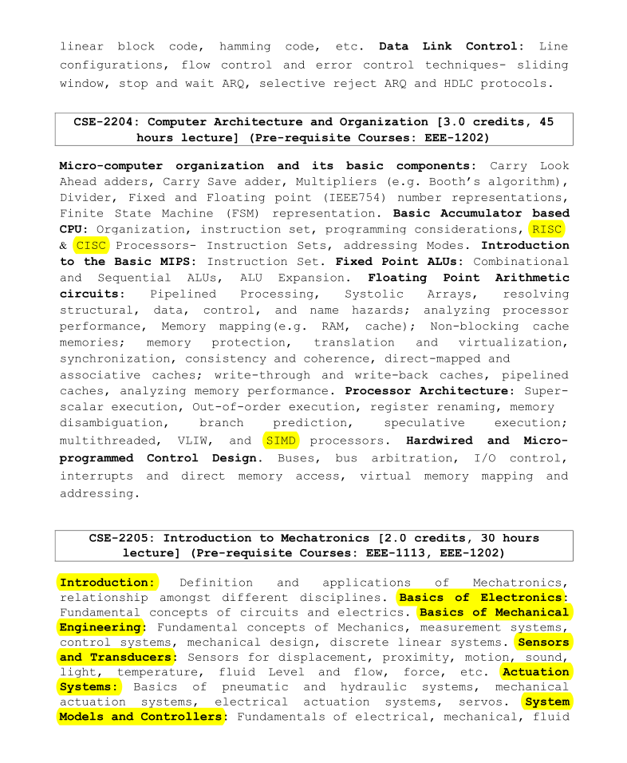

## EEE-2205: Introduction to Mechatronics

Course Teacher

- Md. Ariful Islam, Assistant Professor,  
  Dept. of Robotics and Mechatronics Engineering, University of Dhaka

Reference Books

- Mechatronics by W. Bolton (7th Edition)

##

### Introduction:

    Definition and applications of Mechatronics, relationship amongst different disciplines.

[Lec-1: Fundamentals of Mechatronics](./slides/CSE-2205%20Lec%201.pdf) 

### Basics of Electronics:

    Fundamental concepts of circuits and electrics.

[Lec-4: Basic Electronics](./slides/CSE-2205%20Lec%204.pdf) 
[Lec-4.2: DAC and ADC](./slides/CSE-2205%20Lec%204-5DAC%20ADC.pdf) 
[Lec-5: Basic Electronics part 2](./slides/CSE-2205%20Lec%205.pdf)

### Basics of Mechanical Engineering:

    Fundamental concepts of Mechanics, measurement systems,
    control systems, mechanical design, discrete linear systems.

[Lec-6: Basic Mechanical Engineering](./slides/CSE-2205%20Lec%206.pdf)

### Sensors and Transducers:

    Sensors for displacement, proximity, motion, sound,
    light, temperature, fluid Level and flow, force, etc.

[Lec-2: Fundamentals of Mechatronics Part 2 (Sensors and Transducers Bascis)](./slides/CSE-2205%20Lec%202.pdf) 
[Lec-3: Introduction to Mechatronics Part 3 (Sensor Characteristics)](./slides/CSE-2205%20Lec%203.pdf) 
[Lec-7: Displacement Sensors](./slides/CSE-2205%20Lec%207.pdf) 
[Lec-8: Proximity Sensors](./slides/CSE-2205%20Lec%208.pdf) 
[Lec-9: Motion and Sound Sensors](./slides/CSE-2205%20Lec%209.pdf) 
[Lec-10: Light Sensors](./slides/CSE-2205%20Lec%2010.pdf) 
[Lec-11: Temperature Sensors](./slides/CSE-2205%20Lec%2011.pdf) 
[Lec-12: Level and Flow Sensors](./slides/CSE-2205%20Lec%2012.pdf)

### Actuation Systems:

    Basics of pneumatic and hydraulic systems, mechanical
    actuation systems, electrical actuation systems, servos.

[Lec-13: Pneumatic and hydraulic systems](./slides/CSE-2205%20Lec%2013.pdf) 
[Lec-14: Mechanical Actuation System](./slides/CSE-2205%20Lec%2014.pdf) 
[Lec-15: Mechanical Actuation System Part 2](./slides/CSE-2205%20Lec%2015.pdf) 
[Lec-16: Electrical Actuation System](./slides/CSE-2205%20Lec%2016.pdf) 
[Lec-17: Electrical Actuation System Part 2](./slides/CSE-2205%20Lec%2017.pdf) 
[Lec-18: Electrical Actuation System Part 3](./slides/CSE-2205%20Lec%2018.pdf)

### System Models and Controllers:

    Fundamentals of electrical, mechanical, fluidand thermal systems, electromechanical systems, process
    controllers, control modes, PID and digital controllers, velocity, adaptive, digital logic, microprocessor
    control.

[Lec-19: System Models Class Note](./slides/CSE-2205%20Lec%2019%20class%20note.pdf) _(Chapter-17 p449-458)_ 
[Lec-20: Electrical System Models Class Note](./slides/CSE-2205%20Lec%2020%20class%20note.pdf) _(Chapter-17 p458-462)_ 
[Lec-21: Fluid System Models Class Note](./slides/CSE-2205%20Lec%2021%20lecture%20writings.pdf) _(Chapter-17 p462-467)_ 
[Lec-22: Thermal System Models Class Note](./slides/CSE-2205%20Lec%2022%20class%20written.pdf) _(Chapter-17 p469-471)_ 

### Programmable Logic Controllers:

    Fundamentals of PLCs, mnemonics and timers, relays and
    counters, master and jump control, data control, analog I/O control.

[Lec-23: Programmable Logic Controllers](./slides/CSE-2205%20Lec%2023.pptx)_(Chapter-5 p80-84 Ladder Diagram, Chapter-1 p1-6 PIC)_ 
[Lec-24: Programmable Logic Controller (PLC) Class Note](./slides/CSE-2205%20Lec%2024.pdf)_(Chapter-5 p84-92 Logic functions)_ 
[Lec-25: Programmable Logic Controller (PLC) Class Note](./slides/CSE-2205%20Lec%2025.pdf)_(Chapter-5 p94-101 Function blocks, Chapter-7 p132-142 Internal relays)_ 
[Lec-26: Timers]() _(Chapter-9 p159-166 Logic functions)_ 
[Lec-27: Programmable Logic Controller (PLC) Class Note](./slides/CSE-2205%20Lec%2027.pdf) _(Chapter-10 p174-178,11 p189-191,13 p210-214,14 p250-252)_ 

### Design of Mechatronics Systems:

    Steps of mechatronics system design,
    possible design solutions, case study.

[Lec-28: PLC Simulation](./slides/CSE-2205%20Lec%2028.pdf)

#### Course Outline

